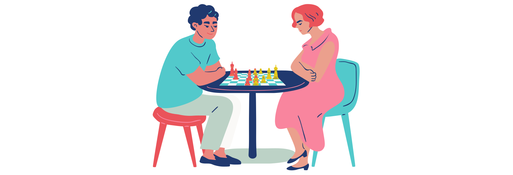

# Finale d'échecs

Ce repo contient le code source d'une implémentation simple d'une finale d'échecs (pièces élémentaires) pouvant être disputée avec 3 modes :
* Joueur contre Joueur
* Joueur contre IA
* IA contre IA (partie automatique)

Les scénarios de fin de partie ayant été développés sont le pat, le mat et la nulle.

## Enjeux

Ce projet a été réalisé en 1ère année de DUT Informatique à l'IUT de Paris - Rives de Seine.  
Son objectif porte sur l'emploi habile des spécificités du langage Java, à savoir travailler sur les questions d'héritage, de polymorphisme et de délégation. 

## Énoncé

Le sujet complet de ce projet ainsi que ses consignes peuvent être consultées depuis [ce document](projet_echecs.pdf) (auteur : Mikal Ziane).

## Membres de l'équipe

* HAN Laurent
* MALONZO Ryan

Groupes 101, 102 (semestre 2)  
Projet BPO2 2020 - 2021 à l'IUT de Paris - Rives de Seine

